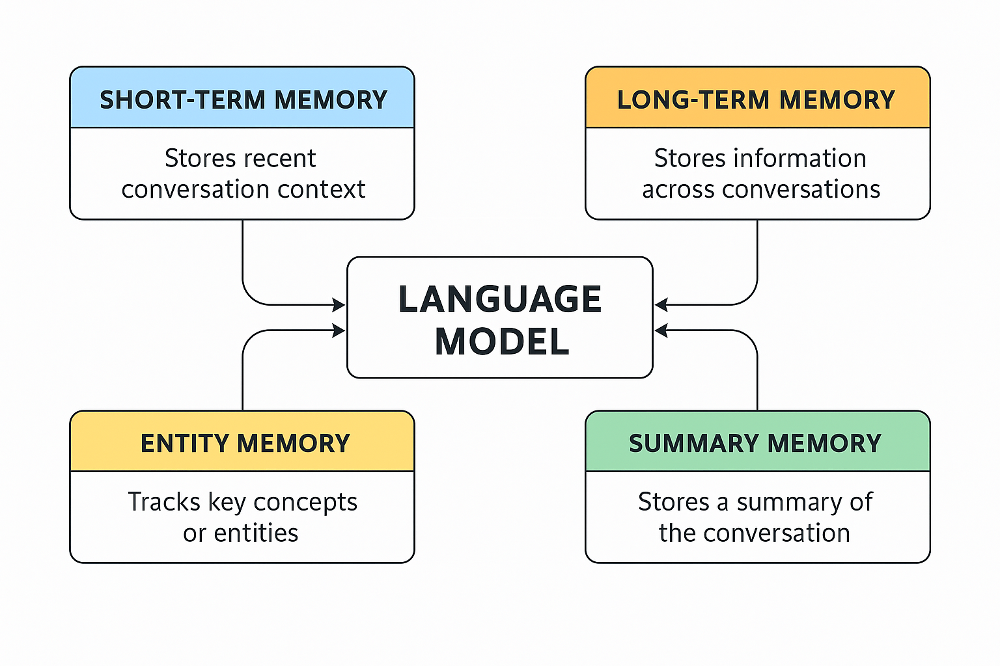

**Context Management** in conversational agents refers to how an AI system keeps track of information during a conversation — both in the short term (what was just said) and in the long term (past interactions, preferences, or facts about the user). This is key to making interactions feel natural, personalized, and coherent.

---

## 🔹 **1. What is Short-Term and Long-Term Context?**

| Type                  | Description                                                                        | Example Use Case                              |
| --------------------- | ---------------------------------------------------------------------------------- | --------------------------------------------- |
| **Short-Term Memory** | Temporary memory for handling recent messages in the current conversation.         | Remembering a user just asked about "weather" |
| **Long-Term Memory**  | Persistent memory that stores facts about the user, their preferences, or history. | Remembering user’s name, preferences, goals   |

---

## 🔹 **2. How Memory Enhances Conversational Agents**

Without memory, a chatbot is stateless — it reacts to each input independently. With memory:

* **Short-term memory** allows for continuity (e.g., pronouns like "it" or "they" make sense).
* **Long-term memory** enables personalization (e.g., remembering the user prefers vegetarian meals).

This improves:

* Engagement
* Accuracy
* Personalization
* Task completion

---

## 🔹 **3. Memory Frameworks for Language Models**

### 🧠 Why Memory Frameworks Matter

Language models (like GPT) are *stateless* by default:

* They only "know" the current prompt
* They **don’t remember** past conversations unless you include them manually

> Without memory: every prompt is like talking to someone with amnesia.

### ✅ Memory Frameworks fix this by:

* Maintaining **short-term context** (ongoing dialogue)
* Storing and retrieving **long-term knowledge** (facts, preferences, past tasks)
* Enabling **personalized, multi-session conversations**

## 🧩 Types of Memory Frameworks

| Memory Type        | Stores                                 | Use Case                                     | Tools                        |
| ------------------ | -------------------------------------- | -------------------------------------------- | ---------------------------- |
| 🧠 Short-Term      | Last N messages                        | Back-and-forth chats                         | `ConversationBufferMemory`   |
| 🗂️ Entity Memory  | Tracked entities (e.g., names, places) | Remembering user-provided info               | `ConversationEntityMemory`   |
| 🧠 Long-Term       | Semantic vector chunks                 | Memory recall across sessions                | `VectorStoreRetrieverMemory` |
| 🔁 Summary Memory  | Summarized history                     | Compressing long chats                       | `ConversationSummaryMemory`  |
| 📦 Combined Memory | Mix of the above                       | Intelligent agents with contextual reasoning | LangGraph, custom routers    |

---
#### ✅ **Real-world Techniques**

* **Embedding past conversations** in a vector store and retrieving them when relevant.
* **Summarizing sessions** and storing summaries as user profiles.
* **Custom user profiles** built from structured knowledge (name, preferences, goals, etc.).

---

## 🔹 **4. Key Design Strategies**

* **Windowing:** Only include the last *n* interactions (for short-term).
* **Summarization:** Periodically summarize long conversations to save context.
* **Entity tracking:** Recognize and follow key subjects/entities across a session.
* **Hybrid memory:** Combine short-term and long-term memories to optimize performance.

---

